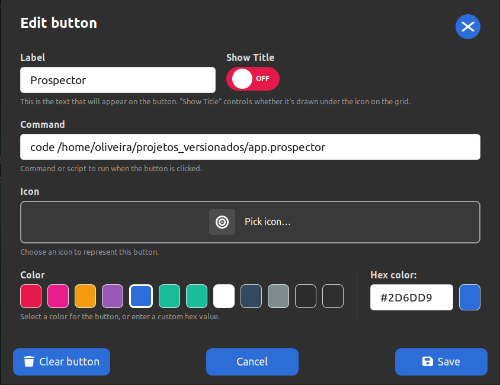

# Xtream Deck


A lightweight, native Stream Deck-style button grid for the **Cinnamon desktop**. No heavy
background app, no separate process — it's a regular Cinnamon desklet, so it's basically free in
terms of CPU/RAM.

Each instance shows a 5x2 grid of buttons, with up to 5 pages (50 buttons total per instance).
Every button has its own label, command, icon, and background color — all configured directly
inside the panel, no external settings screen needed. Comes with the full [Font Awesome
Free](https://fontawesome.com) icon set (7.3.1, ~2,900 icons) bundled in, so you don't need
anything installed on your system to have icons available, plus support for uploading your own
PNG icons and picking any custom hex color for a button's background.

You can add **multiple instances** on your desktop — each one keeps its own independent
configuration.

**Compatibility**: built against and validated on **Linux Mint 21.2 "Victoria" (Cinnamon 5.8.4)**.
It's plain Cinnamon `St`/`Clutter` desklet code with no Mint-specific dependency, so it's expected
to work on other Cinnamon-based distros and other Cinnamon 4.x/5.x versions too — just not
individually tested against every one of them.

## Why this exists

Full Stream Deck-style apps (StreamController, etc.) are great but heavy: separate GTK process,
plugin system, always running. If all you need is "click a button on the desktop, run a command",
a native Cinnamon desklet does the same job for a fraction of the resource cost.

## Requirements

- A Cinnamon desktop (Linux Mint Cinnamon edition, or any distro running Cinnamon 4.x+ — validated
  on Linux Mint 21.2/Cinnamon 5.8.4, see above).
- `git` installed.
- `zenity` installed for the custom PNG icon upload picker (already present by default on most
  Cinnamon/GTK desktops, including Linux Mint).

## Installation

1. Clone this repository:
   ```bash
   git clone https://github.com/sentinela-one/xtream-desklet-deck.git
   cd xtream-desklet-deck
   ```

2. Link it into Cinnamon's desklets folder (Cinnamon only loads desklets from this exact path):
   ```bash
   mkdir -p ~/.local/share/cinnamon/desklets
   ln -s "$(pwd)" ~/.local/share/cinnamon/desklets/xtream-desklet-deck@sentinela-one
   ```

3. Add it to your desktop:
   - Right-click on an empty area of the desktop.
   - Click **Add Desklets**.
   - Find **Xtream Deck** in the list and click **Add** (or double-click it).
   - Repeat this step again if you want a second independent deck.

## Configuring your buttons

Everything is configured from inside the panel itself — there's no separate settings window and
no edit mode to turn on. Buttons behave the same way at all times: click to run, right-click or
click an empty slot to configure.




1. **Open a button's editor**: left-click an empty slot to configure it directly, or right-click
   any slot — empty or already configured — and pick **Edit** from the small menu:
   - **Label** — text shown under the icon. Its color automatically switches between black and
     white depending on the button's own background color, so it stays readable either way.
   - **Show Title** — toggle next to the label field; turns the label under the icon on/off on
     the grid without deleting the text.
   - **Command** — any shell command or script path, run when you click the button.
   - **Icon** — click **Pick icon…** and either search the bundled Font Awesome set (type e.g.
     `microphone`, `camera`, `play`; hover a result to see its full name before picking it), or
     upload your own PNG/JPG/GIF (max 2MB) from the panel next to it.
   - **Color** — pick a background color from the palette (the selected swatch gets a white
     border), clear it back to the default dark background, or type any custom color as a hex
     value (e.g. `#CC99CC`) in the field next to the palette.
   - **Clear button** wipes the slot back to empty. **Save**/**Cancel**/the **X** close the
     editor; closing without saving discards your changes. **Esc** also closes the right-click
     menu if one is open.
2. **Run a button**: once it has a command, a plain left-click runs it.
3. **Reorder buttons**: press and hold a button, drag it onto another slot and release — they
   swap places. No mode to enable first, this works anywhere on the grid.
4. **Move a button to another page**: right-click a configured slot and pick **Move to next
   page** / **Move to previous page** (only shown when the target page has a free slot).
5. Use the numbered dots at the bottom to switch pages. A **+** button next to them adds a new
   page (up to 5 pages per deck, confirmation required). Right-click any dot except the first one
   to remove that page (confirmation required — this deletes every button configured on it).
6. The **gear icon** in the top-right corner opens the deck's About/Remove/Support menu (same
   menu a right-click on the deck itself opens).

### Example button

| Field   | Value |
|---------|-------|
| Label   | `Mute` |
| Command | `amixer set Master toggle` |
| Icon    | search `microphone-slash` in the icon picker |

Any shell command works: launching an app, running a script you wrote, toggling something via
`amixer`/`nmcli`/`obs-cmd`/whatever CLI tool you have — if it runs from a terminal, it runs from a
button here. A common pattern is a button that opens VS Code in a project and, via a
`.vscode/tasks.json` with `"runOptions": {"runOn": "folderOpen"}` in that project, has Claude Code
already running in the integrated terminal by the time the window opens.

## Uninstalling

- Right-click the desklet → **Remove**, to remove it from the desktop.
- Delete the symlink to fully remove it from Cinnamon:
  ```bash
  rm ~/.local/share/cinnamon/desklets/xtream-desklet-deck@sentinela-one
  ```

## How it works / project layout

- `metadata.json` — desklet identity (uuid, name, `max-instances: -1` so you can add as many as
  you want).
- `desklet.js` — renders the header/grid/pagination, the in-panel button editor and dialogs
  (`ButtonEditorDialog`, `IconPickerDialog`, `ConfirmDialog`), drag-to-swap reordering (hand-rolled
  on top of `Clutter`'s low-level pointer events, not Cinnamon's `imports.ui.dnd`), and runs the
  configured command on click (`Util.spawnCommandLine`), using Cinnamon's own `St`/`Clutter`
  toolkit — no extra runtime.
- `icons/fontawesome/` — the bundled Font Awesome Free 7.3.1 icon set (`solid`, `regular`,
  `brands`) plus `manifest.json` used to power the in-panel icon search, and the upstream
  `LICENSE.txt`. See [Attribution](#attribution) below.

Each instance's button configuration (labels, commands, icons, colors, show-title flag, pages) is
stored as plain JSON at `~/.config/xtream-desklet-deck/instances/<instance-id>.json` — not inside
this repository, so your personal commands and paths never need to touch this repo or any fork of
it. If an instance's own state file doesn't exist yet (e.g. right after removing and re-adding the
desklet, which Cinnamon gives a new instance id), it falls back to the most recently saved state
file instead of starting empty. Custom PNG icons you upload are copied into
`~/.config/xtream-desklet-deck/custom_icons/` for the same reason — kept alongside your instance
state, not wherever the original file happened to live.

## Attribution

Icons: [Font Awesome Free](https://fontawesome.com) by Fonticons, Inc., licensed under
[CC BY 4.0](https://creativecommons.org/licenses/by/4.0/) (icons) and
[SIL OFL 1.1](https://scripts.sil.org/OFL) (fonts, unused here — this project only uses the SVG
icon files). Full license text bundled at `icons/fontawesome/LICENSE.txt`.

## License

MIT — see [LICENSE](LICENSE). (Note: the bundled Font Awesome assets under `icons/fontawesome/`
keep their own upstream license, see above.)

## Support

Xtream Deck was built with care to help professionals be more productive. If it earns a spot on
your desktop, consider [buying me a coffee on Ko-fi](https://ko-fi.com/oliveirawro) — the little
coin icon in the bottom-right corner of the deck (and "❤ Support development" in its right-click
menu) link there too.

## Author

Wellington Oliveira — oliveira@woliveira.net
